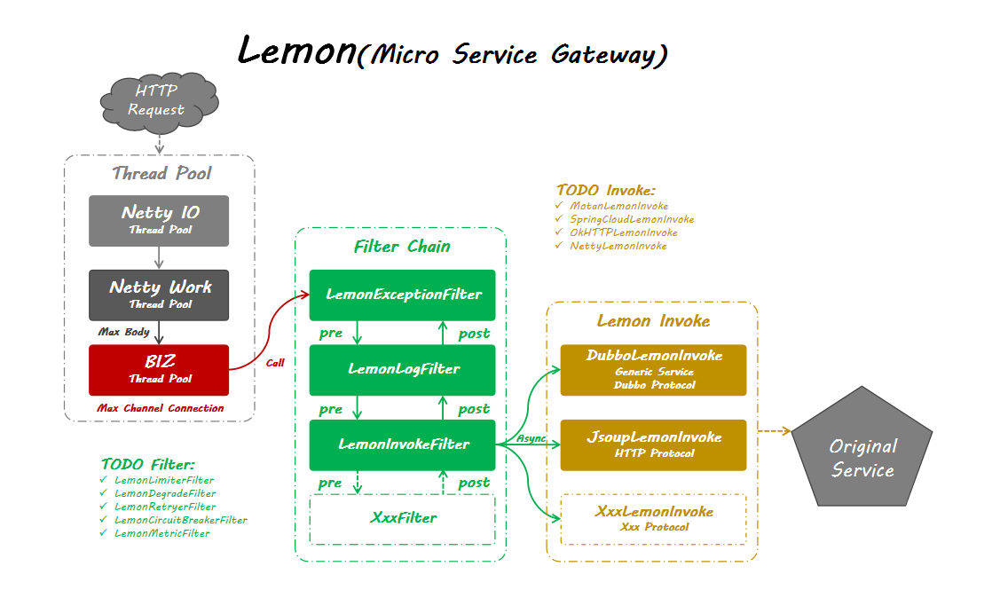

# lemon
**The Micro Service Gateway Framework.**

Lemon is a high-performance, Java based open source gateway framework. 

基于Netty4的微服务网关（Micro Service Gateway）。同时支持Dubbo泛化调用和HTTP调用，并支持自定义实现微服务网关请求的代理转发功能。


**GitHub**：https://github.com/yu120/lemon

**QQ交流群**：微服务基础架构（191958521）

**微信交流**：请加echo-lry


## Architecture


## Features
- HTTP to Dubbo Gateway
- HTTP to HTTP Gateway
- High Performance
- Dynamic Discovery
- Generalized Agent
- Extensible Chain of Responsibility
- Two-way LOG Printing Filter

## TODO
- HTTP proxy Motan
- HTTP proxy SpringCloud
- TCP proxy other
- CircuitBreaker Filter
- Degrade Filter
- Idempotent Filter
- Limiter Filter
- Retry Filter


## Config Introduce
Config Path: `src/main/resources/lemon.yml`

```
port: 8080
application: lemon
# Netty IO/Work thread number
ioThread: 0
workThread: 0
# Body max content length, 64 * 1024 * 1024 = 64 MB
maxContentLength: 67108864
# Max client connection channel number
maxChannel: 100000
# 
bizCoreThread: 20
bizMaxThread: 200
bizQueueCapacity: 800
bizKeepAliveTime: 60000
# Custom Fixed Response Header Parameter Configuration
resHeaders:
  Connection: keep-alive
  Accept-Encoding: gzip,deflate
  Content-Type: application/json;charset=UTF-8
originalHeaders: [Connection, Content-Type, Set-Cookie, Call-Code, Call-Message]
# Dubbo lemon config
dubbo:
  registryAddress: zookeeper://127.0.0.1:2181
  metadataAddress: zookeeper://127.0.0.1:2181
# Direct forwarding HTTP rule
services:
  - category: jsoup
    service: /baidu/**
    url: https://www.baidu.com
  - category: jsoup
    service: /oschina/**
    url: https://www.oschina.net
```

## Dubbo Lemon
The support apache dubbo 2.7.2 generic service proxy.

**Format:**
```
URL:
http://[host]:[port]/lemon/[application]/[service or serviceSimpleName]/[method]?group=[group]&version=[version]

Body:
List[Map{...}, Map{...}, ...]
```

**Example:**
```
http://localhost:8080/lemon/micro-dubbo-provider/cn.micro.biz.dubbo.provider.DemoService/test

or

http://localhost:8080/lemon/micro-dubbo-provider/demo/test

[{"name":"lemon", "age":23}, {"10001"}]
```

## HTTP Lemon
Proxy forwarding using jsoup.

```
http://[host]:[port]/lemon/[service]/**?group=[group]&version=[version]
```

## Motan Lemon
TODO

## Spring Cloud Lemon
TODO

## Packing and Installation
```
mvn clean install -Denforcer.skip=true -Dmaven.test.skip=true
```
The target directory: `target/lemon-1.0.0-SNAPSHOT-dist.tar.gz`

After successful execution, `lemon-1.0.0-SNAPSHOT-dist.tar.gz` will be generated in the directory of `target`.

## Start lemon
```
> tar -zxvf lemon-1.0.0-SNAPSHOT-dist.tar.gz
> cd bin
> ./app start
# Usage: app { console | start | stop | restart | status | dump }
```

## Use Arthas
Alibaba [Arthas](https://github.com/alibaba/arthas)

**arthas-boot**:
```
> wget https://alibaba.github.io/arthas/arthas-boot.jar
> java -jar arthas-boot.jar
```

**as.sh**:
```
> curl -L https://alibaba.github.io/arthas/install.sh | sh
> ./as.sh
```
可以直接访问：http://127.0.0.1:8563

## Start service provider
The metadata report config must be used.

```
import DemoService;
import DemoServiceImpl;
import org.apache.dubbo.config.*;

public class ProviderDemo {

    public static void main(String[] args) throws Exception {
        // Implementation
        DemoService demoService = new DemoServiceImpl();

        // Application Info
        ApplicationConfig application = new ApplicationConfig();
        application.setName("micro-dubbo-provider");

        // Registry Info
        RegistryConfig registry = new RegistryConfig();
        registry.setAddress("zookeeper://127.0.0.1:2181");

        // Metadata Report Info
        MetadataReportConfig metadataReportConfig = new MetadataReportConfig();
        metadataReportConfig.setAddress("zookeeper://127.0.0.1:2181");

        // Protocol
        ProtocolConfig protocol = new ProtocolConfig();
        protocol.setName("dubbo");
        protocol.setPort(12345);
        protocol.setThreads(200);

        // Exporting: In case of memory leak, please cache.
        ServiceConfig<DemoService> service = new ServiceConfig<>();
        service.setApplication(application);
        // Use setRegistries() for multi-registry case
        service.setRegistry(registry);
        // Use setProtocols() for multi-protocol case
        service.setProtocol(protocol);
        service.setMetadataReportConfig(metadataReportConfig);
        service.setInterface(DemoService.class);
        service.setRef(demoService);

        // Local export and register
        service.export();
        System.in.read();
    }

}
```

## License
Lemon is under the MIT license. See the LICENSE file for details.
